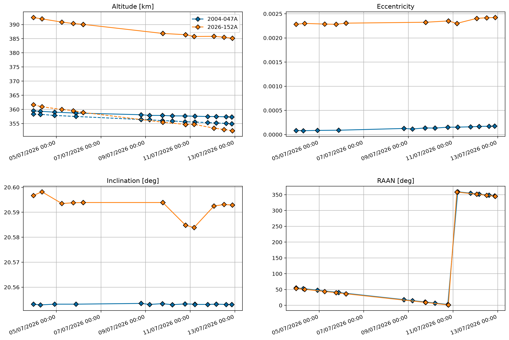

# CelesTrak live downloader

This project downloads regularly satellite orbit data from [CelesTrak](https://celestrak.org) and saves it to a csv file.

* 2004-047A: SWIFT telescope
* 2026-152A: LINK servicing satellite

